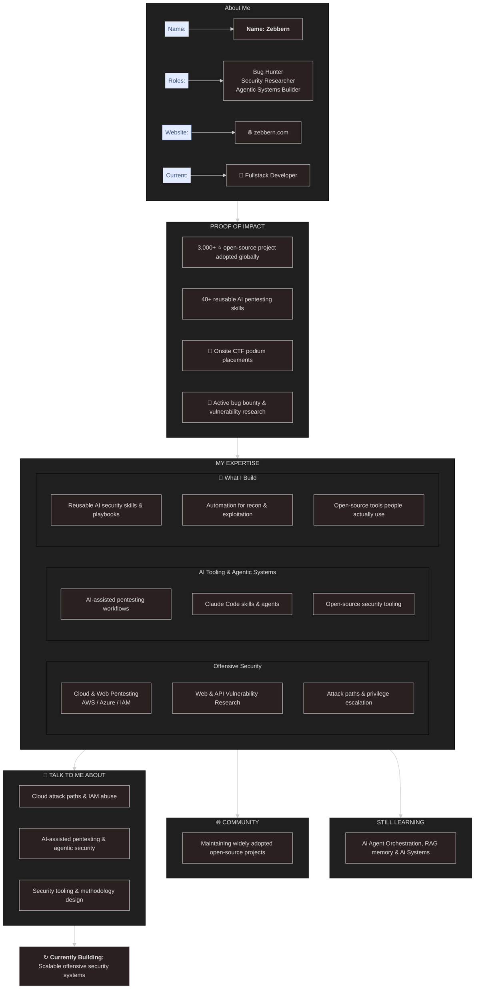

  <h5>

  </h5>

  

        <pre><h3>Click Box For More About Me :p </h3></pre>
  

---

**Bug Hunter** • **Security Researcher** • **Agentic Systems Builder**

Visit: [zebbern.com](https://zebbern.com)

    
  
  
  
  
  
      

  <table border="1">
    <tr>
      <td align="center"><kbd>👨‍💻 Ethical Hacker</kbd></td>
      <td align="center"><kbd>🛡️ CompTIA Security+</kbd></td>
      <td align="center"><kbd>🏆 CEH</kbd></td>
      <td align="center"><kbd>💻 OSCP In Progress</kbd></td>
    </tr>
  </table>

 

 

<h3 align="center"><code>Mostly Work With:</code></h3>

  &nbsp;&nbsp;
  &nbsp;&nbsp;
  &nbsp;&nbsp;
  &nbsp;&nbsp;
  &nbsp;&nbsp;
  &nbsp;&nbsp;
  &nbsp;&nbsp;
  &nbsp;&nbsp;
  

---

<h3>Connect Via 
   
   
  

  
  &nbsp;&nbsp;&nbsp;
  
  &nbsp;&nbsp;&nbsp;
  

</h3> 

 <!-- &nbsp;&nbsp;&nbsp;&nbsp;&nbsp;&nbsp;&nbsp;  -->

