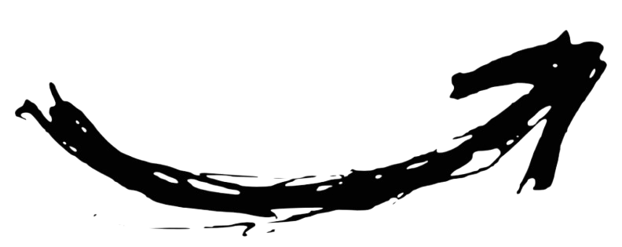

  <h5>
    👾 <a href="https://github.com/zebbern/BugHunterz" align="left">𝐁𝐮𝐠 𝐇𝐮𝐧𝐭𝐞𝐫</a> 
    
  </h5>

  

     
        <h3>
          Click <code>Here</code> For More About Me!
        </h3>
     
  

---

  

<kbd>

<h2>👤 Who am I?</h2>

<h3><b>🔹 Name: Zebbern</h3>
<h3><b>🔹 Role:  <kbd>🛡️ Bug Hunter|🔍 Security Researcher|🕵️ Forensics Analyst</kbd></h3>

<h2>💻 My Expertise</h2>

<h3><b>🔹 🧩 Reverse Engineering | 🦠 Malware Analysis</h3> 
<h3><b>🔹 🎯 Specializing in Website Vulnerabilities & Exploits</h3> 
<h3><b>🔹 🕶️ Skills: <kbd>Bug Hunting, Digital Forensics, Social Engineering, OSINT</h3>

<h2>🚀 Currently Exploring</h2>

<h3><b>🔹 Expanding my knowledge in Cybersecurity & Exploit Development</h3> 
<h3><b>🔹 Learning everything I can get my hands on!</h3> 

</kbd> 

  

<kbd>
  
<h3> Still Learning:</h3>

<kbd>🔹<strong>Bug hunting & malware forensics.</strong></kbd> 

<h3>Community Leadership:</h3>
  
<kbd>🔹<strong>Managing tech communities & creating content.</strong></kbd>

<h3>Development:</h3> 

<kbd>🔹<strong>Writing useful tools for myself & the community.</strong></kbd> 

<h3>Open Source:</h3> 

 <kbd>🔹<strong>Building & contributing to various projects.</strong></kbd>

<h3>Currently Exploring:</h3>

 <kbd>🔹<strong>Mobile pentesting & Web3 security.</strong></kbd>

 <h3> ↻  <kbd>`Updating`</kbd> : Journey to becoming a Cybersecurity Specialist.</kbd></h3>

    
  
  
  
  
  
      

  <table border="1">
    <tr>
      <td align="center"><kbd>👨‍💻 Ethical Hacker</kbd></td>
      <td align="center"><kbd>🛡️ CompTIA Security+</kbd></td>
      <td align="center"><kbd>🏆 CEH</kbd></td>
      <td align="center"><kbd>💻 OSCP In Progress</kbd></td>
    </tr>
  </table>

  <!-- GitHub Streak Stats -->
  

  
  

   

<h3 align="center"><code>Tools and technologies I work with!</code></h3>

  &nbsp;&nbsp;
  &nbsp;&nbsp;
  &nbsp;&nbsp;
  &nbsp;&nbsp;
  &nbsp;&nbsp;
  &nbsp;&nbsp;
  &nbsp;&nbsp;
  &nbsp;&nbsp;
  &nbsp;&nbsp;
  &nbsp;&nbsp;
  

---

<h3>Connect Via 
   
   
  

  
  &nbsp;&nbsp;&nbsp;
  
  &nbsp;&nbsp;&nbsp;
  
  &nbsp;&nbsp;&nbsp;
  
  &nbsp;&nbsp;&nbsp;
  

</h3> 

<!--  &nbsp;&nbsp;&nbsp;&nbsp;&nbsp;&nbsp;&nbsp;  -->

