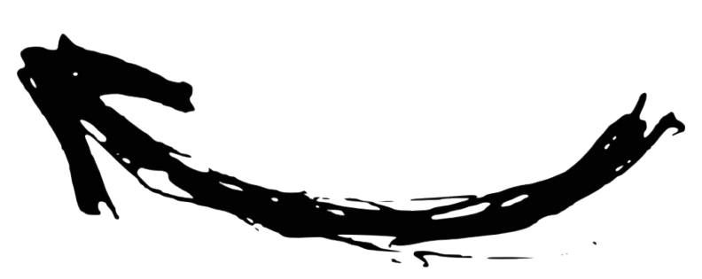

  <h1> 𝐖𝐞𝐥𝐜𝐨𝐦𝐞 𝐭𝐨 𝐌𝐲 𝐆𝐢𝐭𝐡𝐮𝐛 𝐏𝐫𝐨𝐟𝐢𝐥𝐞 </h1>

    

  
  &nbsp;&nbsp;
  
  
  &nbsp;&nbsp;
  
  

  <table>
    <tr>
      <td align="center"> <b>👨‍💻 Ethical Hacker</b></td>
      <td align="center"> <b>🛡️ CompTIA Security+</b></td>
      <td align="center"> <b>🏆 CEH</b></td>
      <td align="center"> <b>👨‍💻 OSCP In Progress</b></td>
    </tr>
  </table>

- *[Ethical Hacking](https://www.hacker101.com/)*
- *[Network Defense](https://tryhackme.com/)*
- *[Vulnerability Assessment](https://www.reflectiz.com/blog/owasp-top-ten-2024/)*

  
  

  <h1><strong>🏆 Github Profile Trophy</strong></h1>

  

    
  

  

---

  

